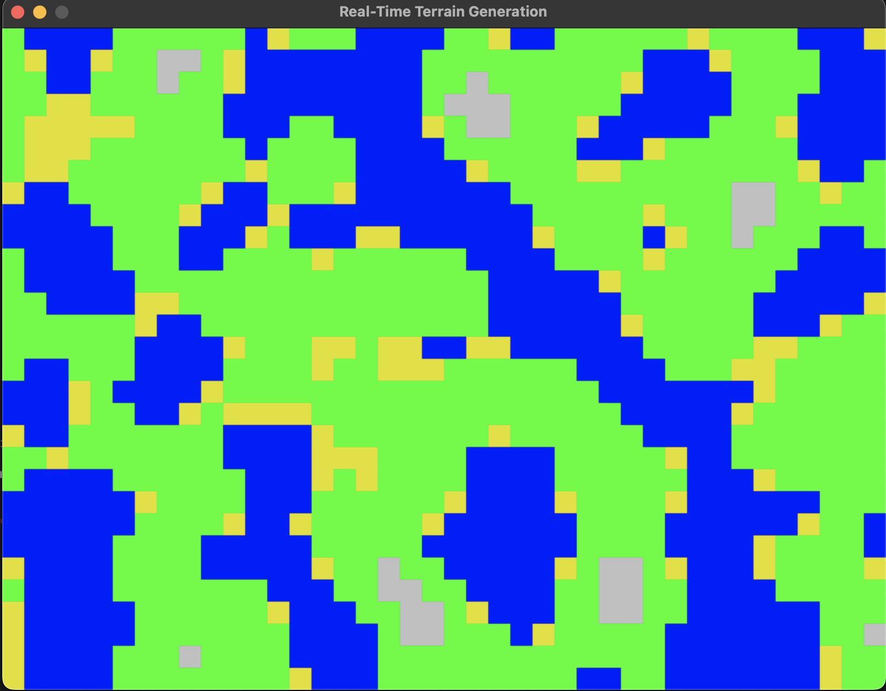

# Procedural Terrain Generation using Perlin Noise

Playground/Sandbox to see Perlin Noise in action and to generate some procedural terrain.

## Setup

```shell
python -m venv ./venv
source venv/bin/activate
pip install -r requirements.txt
```

## Activate environment

```shell
source venv/bin/activate
```

## Run Real-Time Terrain Generation with Perlin Noise

```shell
python perlin_2d.py
```

Move using arrows. 


